Built my first PC at 15 and got pulled into software right after. How it runs, how it's built, how it all comes together. These days I build AI-integrated web tools, and I keep gravitating toward problems where software has to touch something real: video frames, timelines, machines in a back office.

📍 Boston, MA · 🎓 Northeastern CS '28 · 🌐 [alitleis.dev](https://alitleis.dev) · 💼 [LinkedIn](https://www.linkedin.com/in/ali-tleis-091800247/) · ✉️ [Email](mailto:Tleis.a@northeastern.edu)

## 🎞️ Experience

**MIT Lincoln Laboratory** · Web Application Developer (AI Integration)
Building AI-integrated internal web tools at a DoD research lab operated by MIT.

**Top Choice Realty** · Frontend Developer Intern
React/TypeScript component systems, MongoDB schema refactoring, and Python/C# automation pipelines that cut reconciliation time 30%.

**Robert DeFalco Realty** · Computer Technician Intern
WinPE OS imaging across 20+ systems, PowerShell automation scripts, Azure DevOps CI workflows.

## 🎚️ Stack

## 🚀 Selected work

🎬 **[DaVinci Smart Upscale](https://github.com/Alitleis123/DaVinchi-Resolve-Smart-Upscale-Plugin)** · `Python` `Lua` `OpenCV`
Auto-detects motion frames, reconstructs timelines, and upscales footage to 4K without leaving DaVinci Resolve.

🏠 **[Top Choice Realty Platform](https://github.com/Alitleis123/topchoicerealty)** · `Next.js` `MongoDB`
Full-stack real estate management with JWT auth and role-based access control.

🤖 **[Eternal Summary](https://github.com/Alitleis123/Eternal-Summary)** · `MV3` `Node`
Chrome extension that summarizes any page in real time against the OpenAI API.

## 📼 Now

<!-- NOW:START -->
- 🔨 [`AliTleis.dev`](https://github.com/Alitleis123/AliTleis.dev) · Redesign site: new palette, search, tighter layout · today
- 🔨 [`Better-Canvas`](https://github.com/Alitleis123/Better-Canvas) · Better Canvas 3.1: design tokens, instant settings, lifecycle fixes · 25d ago
<!-- NOW:END -->

---

⚡ This page edits itself. A [GitHub Action](.github/workflows/refresh-profile.yml) runs [`refresh-profile.mjs`](scripts/refresh-profile.mjs) daily. It rewrites the **Now** block from my recent pushes and slides the **NOW** playhead on the timeline to today's date. The graphics are hand-written SVG: no image hosts, no third-party badge services, and all motion stops under `prefers-reduced-motion`.
