<div align="center">



[](https://alitleis.dev)
[](https://www.linkedin.com/in/ali-tleis-091800247/)
[](mailto:Tleis.a@northeastern.edu)

</div>

## `> whoami` 🧑‍💻

```yaml
role:      "Web App Developer (AI Integration) @ MIT Lincoln Laboratory"
focus:     "AI-integrated web tools · automation · full-stack product"
location:  "Boston, MA"
education:
  school:  "Northeastern University"
  degree:  "B.S. Computer Science"
  class:   2028
  program: "Co-op"
previously:
  - "⚛️  Frontend Developer Intern @ Top Choice Realty"
  - "🖥️  Computer Technician Intern @ Robert DeFalco Realty"
origin:    "Built my first PC at 15. Never stopped taking things apart."
```

## `> stack` 🧰

`TypeScript` `Python` `React` `Next.js` `Node` `PostgreSQL` `MongoDB` `Docker` `C#` `OpenCV`

## `> selected_work` 🚀

🎬 **[DaVinci Smart Upscale](https://github.com/Alitleis123/DaVinchi-Resolve-Smart-Upscale-Plugin)** · `Python` `Lua` `OpenCV`
Auto-detects motion frames, reconstructs timelines, and upscales footage to 4K without leaving DaVinci Resolve.

🏠 **[Top Choice Realty Platform](https://github.com/Alitleis123/topchoicerealty)** · `Next.js` `MongoDB`
Full-stack real estate management with JWT auth and role-based access control.

🤖 **[Eternal Summary](https://github.com/Alitleis123/Eternal-Summary)** · `MV3` `Node`
Chrome extension that summarizes any page in real time against the OpenAI API.

## `> now` 🚧

<!-- NOW:START -->
- 🔨 [`AliTleis.dev`](https://github.com/Alitleis123/AliTleis.dev) — refresh resume pdf · 8d ago
- 🔨 [`Better-Canvas`](https://github.com/Alitleis123/Better-Canvas) — Better Canvas 3.1: design tokens, instant settings, lifecycle fixes · 25d ago
<!-- NOW:END -->

<div align="center">
<sub>⚡ The <code>now</code> block rewrites itself daily from a GitHub Action · <a href="scripts/update-now.mjs">see how</a></sub>
</div>
