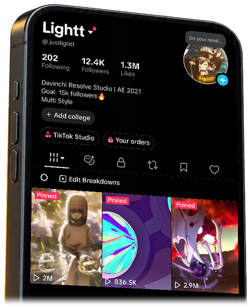

🔬 <strong>MIT Lincoln Laboratory</strong> &middot; Web Application Developer, AI Integration co-op 
🔎 AI search for <strong>4,500+ engineers</strong> &middot; ⚡ 70% lower query latency 
🔒 Security Clearance: DoD Investigation in Progress 
🎓 Northeastern CS + Sociology '28 &middot; Boston 
🚀 Open to <strong>Summer 2027 SWE / AI internships</strong>

### 🎬 Why the editing theme

<a href="https://www.tiktok.com/@.justlightt"><picture><source media="(max-width: 600px)" srcset="assets/tiktok-phone-mobile.webp"><source media="(min-width: 601px)" srcset="assets/tiktok-phone.webp" width="150"></picture></a>

✂️ I make anime, show and movie edits in After Effects for 12.4K followers. My top post reached 2.9M views. 🛠️ I built Eternal2x for my own edits. The DaVinci Resolve tool treats held frames on 2s as deliberate. I like making tools as much as edits. I study CS + Sociology at Northeastern and spend time with the Video Editing Club and Arab Student Association.

[🎬&nbsp;**Eternal2x**](https://eternal2x.com) &middot; [Code](https://github.com/Alitleis123/Eternal2x.com) 
[🖥️&nbsp;**EternalMonitor**](https://eternalmonitor.dev) &middot; [Code](https://github.com/sidebandstudio/EternalMonitor) 
[🤖&nbsp;**Eternal&nbsp;Summary**](https://alitleis123.github.io/Eternal-Summary/) &middot; [Code](https://github.com/Alitleis123/Eternal-Summary)

🧰 `Java` `Python` `TypeScript` `Rust` &middot; `React` `FastAPI` `Solr` `Docker`

 

